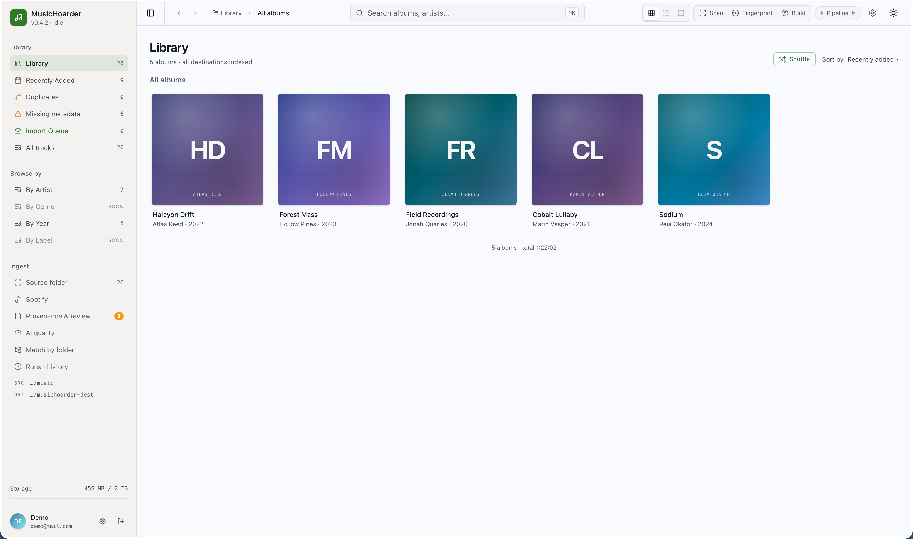
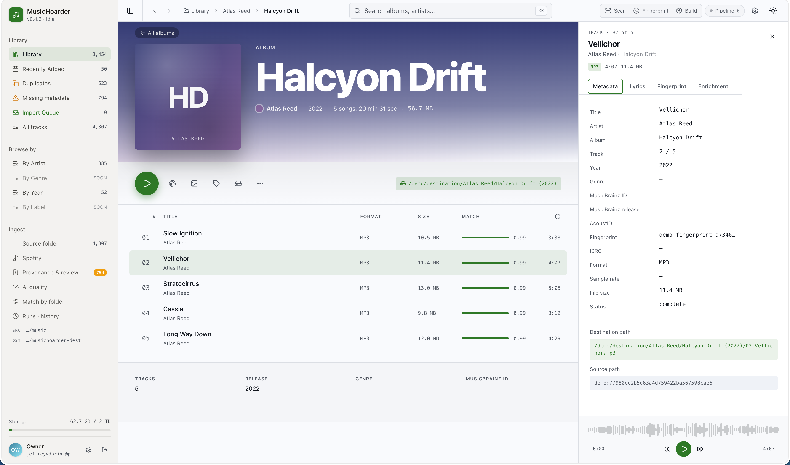
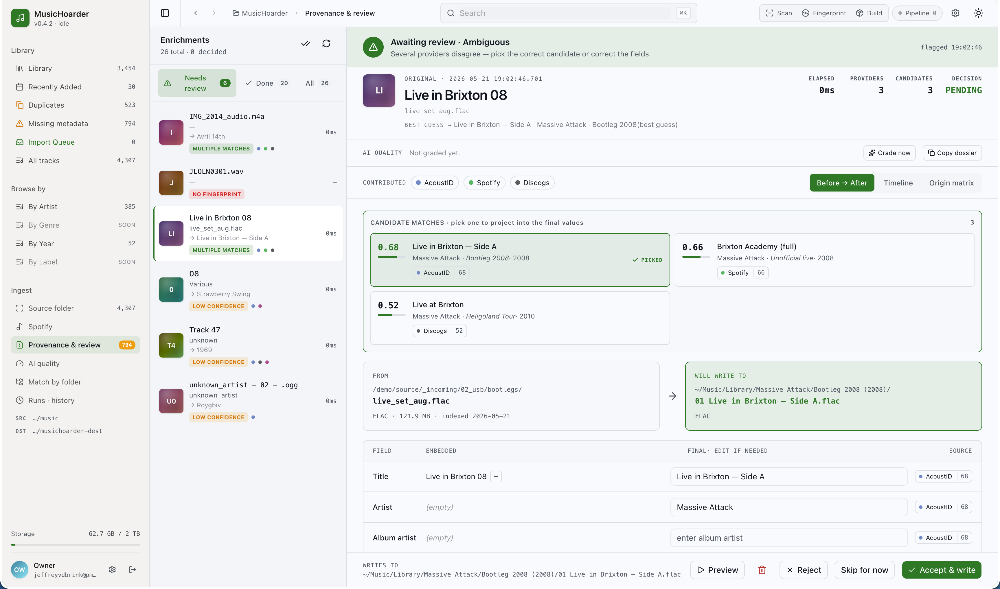

# MusicHoarder

**Fix your messy music library — automatically.**

MusicHoarder is a self-hosted, open-source tool that scans a large, disorganized music collection
(including NAS/SMB shares), identifies each track by its actual audio, enriches it with proper
metadata, and builds a clean, consistently-organized copy — without ever touching your originals.

[](https://github.com/Jeffreyyvdb/MusicHoarder/actions/workflows/ci.yml)
[](LICENSE)

If you've ever ended up with thousands of files like `track_047.mp3`, duplicate rips at different
bitrates, missing artwork, and inconsistent folder names, this is for you. Point it at your source
library, let it run, and review anything it isn't sure about.



## Features

- **Audio fingerprinting** — identifies tracks by their sound (AcoustID/Chromaprint), not by
  unreliable filenames or existing tags.
- **Multi-source enrichment** — fills in artist, album, title, track number, year, and artwork from
  **MusicBrainz**, **Spotify**, **Apple Music**, and **Deezer** (plus custom community trackers),
  combining providers for confidence.
- **Cover art** — resolves album artwork (Cover Art Archive, embedded pictures, provider images),
  surfaces it throughout the app, and writes it into the destination library so players like
  Navidrome show the real sleeve.
- **Reconciled album tracklists** — shows the *full* tracklist for each album, cross-checked across
  MusicBrainz, Spotify, Apple Music, and Deezer, with missing tracks greyed out so gaps are obvious.
- **Synced lyrics** — fetches time-synced lyrics where available.
- **Duplicate detection** — finds the same recording across formats/bitrates.
- **Soulseek quality upgrades (optional)** — connect a self-run [slskd](https://github.com/slskd/slskd)
  instance to fill wishlist tracks from Soulseek (falling back to yt-dlp) and to manually upgrade
  existing tracks to better copies (e.g. Opus → FLAC) without losing enrichment, lyrics, or track ids.
- **Instance sync (optional)** — push finished tracks from a private instance to a public one over
  HTTPS, with a fingerprint-based existence check so only missing or better-quality files transfer,
  and in-place replacement that keeps the remote's track ids stable.
- **Non-destructive by design** — source files are read-only; everything is written as fresh,
  cleanly-named copies in a separate destination library.
- **Manual review** — anything the pipeline isn't confident about lands in a review queue instead of
  being guessed at.
- **Optional AI quality review** — an LLM pass can grade match/metadata quality to help you triage
  what actually needs attention (OpenAI-compatible; defaults to OpenRouter).
- **Web UI** — browse your library by album, track, artist, year, or folder with cover-art grids,
  play tracks in a built-in waveform player, jump anywhere with a ⌘K command palette, watch scan &
  enrich progress live, review matches, and inspect quality — with a polished mobile layout.
- **Self-hosted** — runs on your own hardware via .NET Aspire (dev) or Docker Compose (prod); your
  music never leaves your machine.



## How it works

The pipeline is a state machine over each song, run by background workers that each sweep for work
in the status they handle:

```
Source library
   → Scan          index files (incl. SMB/NAS)
   → Fingerprint   compute an audio fingerprint (fpcalc/Chromaprint)
   → Enrich        identify via AcoustID fingerprint, then match against MusicBrainz,
                   Spotify, Apple Music, Deezer + custom community trackers
   → Dedupe        detect duplicate recordings
   → Review        low-confidence matches wait for a human (optional AI quality review)
   → Build         copy + tag + organize into the destination library
```

Confident matches flow straight through to a clean destination library; uncertain ones surface in
the review UI. The source is never modified, and removed/missing files are soft-deleted rather than
purged.



## Tech stack

| Project | Description |
|---------|-------------|
| `MusicHoarder.Api` | ASP.NET Core minimal API — endpoints, EF Core/PostgreSQL persistence, background services |
| `MusicHoarder.AppHost` | .NET Aspire AppHost — composes the API, frontend, and PostgreSQL for local dev |
| `MusicHoarder.ServiceDefaults` | Shared cross-cutting defaults (health checks, OpenTelemetry, resilient HTTP) |
| `frontend` | Svelte + Bun — library browser, live scan/enrich progress, review UI |

---

## Quickstart (local development)

### Prerequisites

- .NET 10 SDK
- Docker (for PostgreSQL via Aspire)
- Bun (frontend toolchain); Node.js 22 only for the semantic-release step
- `fpcalc` (`libchromaprint-tools`) for fingerprinting
- [Aspire CLI](https://aspire.dev) (optional — enables `aspire run`; otherwise use `dotnet run`)

### Run with Aspire (recommended)

```bash
aspire run
```

That's the whole thing. On first run the Aspire dashboard (at `https://localhost:17072`) prompts for
the two required values — your **source** and **destination** library paths — then provisions
PostgreSQL in Docker, launches the API, and starts the frontend. EF Core migrations are applied
automatically.

> No Aspire CLI? `dotnet run --project MusicHoarder.AppHost` does exactly the same thing. Install
> the CLI with `curl -sSL https://aspire.dev/install.sh | bash`.

**Optional — skip the prompts.** Pre-seed the paths (and any provider keys) as AppHost user-secrets
so boots are unattended and repeatable:

```bash
mkdir -p /tmp/musichoarder-source /tmp/musichoarder-dest
dotnet user-secrets set "Parameters:source-directory" "/tmp/musichoarder-source" --project MusicHoarder.AppHost
dotnet user-secrets set "Parameters:destination-directory" "/tmp/musichoarder-dest" --project MusicHoarder.AppHost
```

Drop a few audio files into your source directory, then trigger a scan from the UI (or let the
pipeline auto-run) to watch them flow through.

### Frontend (standalone)

The AppHost runs the frontend via `.WithBun()`. To start it separately:

```bash
cd frontend && MUSICHOARDER_API_URL=http://localhost:<api-port> PORT=3000 bun run dev
```

Find the API port in the Aspire dashboard.

### Run tests

```bash
dotnet test MusicHoarder.Api.Tests/MusicHoarder.Api.Tests.csproj
```

The xUnit suite uses an in-memory EF Core provider — no PostgreSQL or Docker required.

---

## Configuration

All options live under the `MusicEnricher` section in `appsettings.json` or as environment variables
using the `MusicEnricher__` prefix.

| Key | Description | Required |
|-----|-------------|----------|
| `MusicEnricher__SourceDirectory` | Path to the source music library | Yes |
| `MusicEnricher__DestinationDirectory` | Path for the cleaned destination library | Yes |
| `MusicEnricher__AutoStartPipeline` | Auto-run the *processing* cascade (scan→fingerprint→enrich→build, enrichment backfill/retry sweep). Discovery (file indexing) always runs so the library still populates. Set `false` to require manual triggering of the heavy steps — useful in resource-constrained environments. | No (default: `true`) |
| `MusicEnricher__TempDirectory` | Scratch space for in-progress work | No (default: `/tmp/musicenricher`) |
| `MusicEnricher__AcoustIdApiKey` | AcoustID API key for fingerprint-to-MusicBrainz lookup | No (enrichment falls back to `NeedsReview` without it) |
| `MusicEnricher__AcoustIdScoreThreshold` | Minimum confidence score to accept a match (0–1) | No (default: `0.85`) |
| `MusicEnricher__SmbConcurrency` | Parallel file reads from SMB | No (default: `8`) |
| `MusicEnricher__EnrichmentWorkerConcurrency` | Parallel AcoustID lookups | No (default: `2`) |
| `ConnectionStrings__musichoarderdb` | PostgreSQL connection string | Yes (injected by Aspire in dev) |

Spotify metadata is optional and requires registering a Spotify app and configuring the OAuth relay.

AI quality grading and the **experimental AI lyrics transcription** feature are also optional and
configured separately (under the `QualityGrading__` and `LyricsTranscription__` prefixes). Lyrics
transcription is **hidden in the UI unless `LyricsTranscription__ApiKey` is set** — see the
[self-hosting guide](docs/SELF_HOSTING.md#optional-integrations).

---

## Self-host

Run MusicHoarder on your own box or NAS with Docker. The shipped `docker-compose.yml` **pulls
prebuilt images** from GHCR (`ghcr.io/jeffreyyvdb/musichoarder/{api,frontend}`) — no repo checkout
or build toolchain required. You only need two files: the compose file and an `.env`.

```bash
mkdir musichoarder && cd musichoarder
curl -fsSLO https://raw.githubusercontent.com/Jeffreyyvdb/MusicHoarder/main/docker-compose.yml
curl -fsSL  https://raw.githubusercontent.com/Jeffreyyvdb/MusicHoarder/main/.env.example -o .env
nano .env          # fill in the 5 required values
docker compose up -d
```

Required values in `.env`: `POSTGRES_PASSWORD`, `MUSIC_SOURCE_PATH`, `MUSIC_DESTINATION_PATH`,
`OWNER_EMAIL`, and `PUBLIC_BASE_URL`. The web UI is then at `http://<host-ip>:3000` (API at
`:5050`); migrations apply automatically.

The app serves plain HTTP — put it behind your own reverse proxy for TLS and point
`PUBLIC_BASE_URL` at the external URL.

**→ Full guide:** [docs/SELF_HOSTING.md](docs/SELF_HOSTING.md) — env reference, first login,
reverse proxy, Portainer/TrueNAS, optional integrations (AcoustID, Spotify, AI grading, AI lyrics
transcription, Umami), updating, backups, build-from-source, and troubleshooting.

---

## Deployment (CI/CD)

The whole repo (API **and** frontend together) is versioned as a single line by
[semantic-release](https://github.com/semantic-release/semantic-release). Deployment is
release-driven — only a semantic-release version publishes images and redeploys; routine
`chore`/`docs`/`refactor` pushes do not.

```
Push to main
     ↓
ci.yml          — dotnet build+test, frontend lint/check/test (also on PRs)
     ↓
release.yml     — semantic-release analyzes Conventional Commits; if warranted,
                  cuts a `vX.Y.Z` tag + GitHub Release, then dispatches ↓
     ↓
aspire-deploy.yml — builds the API + frontend images, pushes them to GHCR, semver-tags
                  them, then calls the Dokploy API to redeploy the Compose stack
```

The version bump follows the commit prefix — `fix:` → patch, `feat:` → minor,
`feat!:`/`BREAKING CHANGE:` → major; `chore`/`docs`/`refactor`/`test`/`style` cut no release. The
[Releases page](https://github.com/Jeffreyyvdb/MusicHoarder/releases) is the canonical changelog.

### Zero-downtime deploys

The prod compose (`MusicHoarder.AppHost/aspire-output/docker-compose.yaml`) declares a Swarm
`deploy.update_config` (`order: start-first`) plus Docker `healthcheck`s on the `api` and `frontend`
services. To get zero-downtime rollouts you must run the stack as a **Docker Stack (Swarm)** — in
Dokploy set the Compose service's **Compose Type to "Docker Stack"**. Swarm then starts the new task,
waits for its healthcheck to pass, and only then removes the old one, so there is no 502 window.
(Because Swarm ignores `pull_policy`, the stack deploy must run with `--resolve-image always` so the
unchanged `:latest` reference still re-pulls the newest digest.)

These keys are inert under plain `docker compose up` (Compose ignores `deploy.update_config`), so the
[Self-host](#self-host) path above is unaffected and keeps its current stop-then-start behavior —
self-hosters who want zero-downtime can likewise run their stack via `docker stack deploy`.

Operational detail — PR preview environments, the Spotify OAuth relay, and the Dokploy setup — lives
in the heavily-commented workflow files under [`.github/workflows/`](.github/workflows).

---

## Pipeline notes

### fpcalc + AcoustID

`fpcalc` (Chromaprint) is included in the Docker image via `libchromaprint-tools`. Without
`MusicEnricher__AcoustIdApiKey`, enrichment sets songs to `NeedsReview` rather than `Matched`, and
the Library Builder skips them.

### Library page modes

The frontend Library page has two modes:

- **Source** — all scanned songs.
- **Destination** — only songs that completed the full pipeline (Matched → Copied/Tagged/Done).

### EF Core migrations

Migrations are applied automatically on container startup in all environments. No manual migration
steps are required after a new image is deployed.

---

## Contributing & license

- **Contributing:** see [CONTRIBUTING.md](CONTRIBUTING.md). Commit messages follow
  [Conventional Commits](https://www.conventionalcommits.org/) — they drive the shared
  semantic-release version.
- **Security:** report vulnerabilities per [SECURITY.md](SECURITY.md).
- **License:** [MIT](LICENSE).
