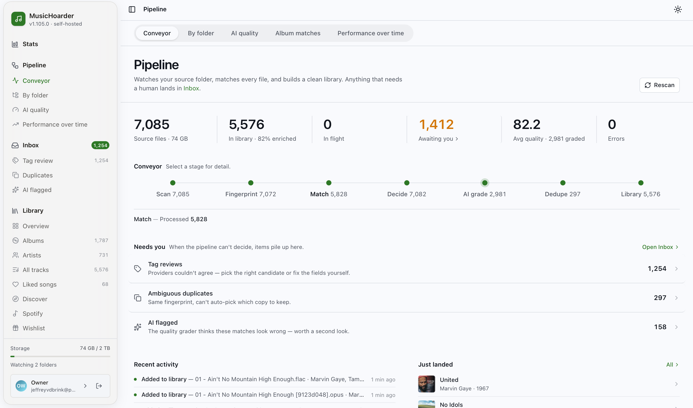
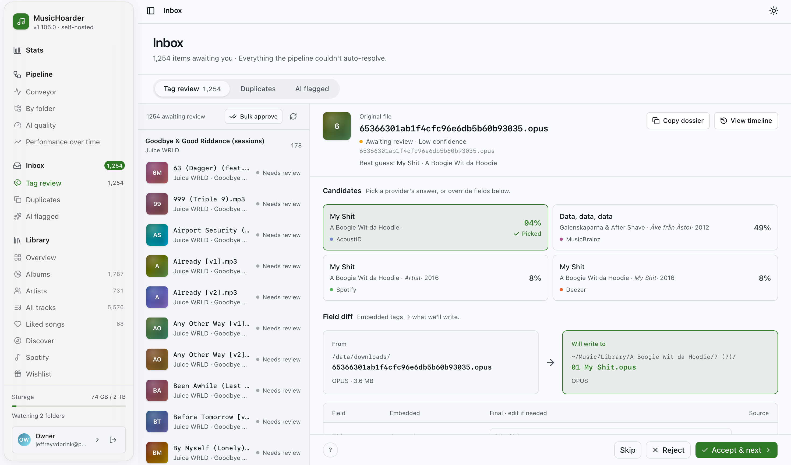
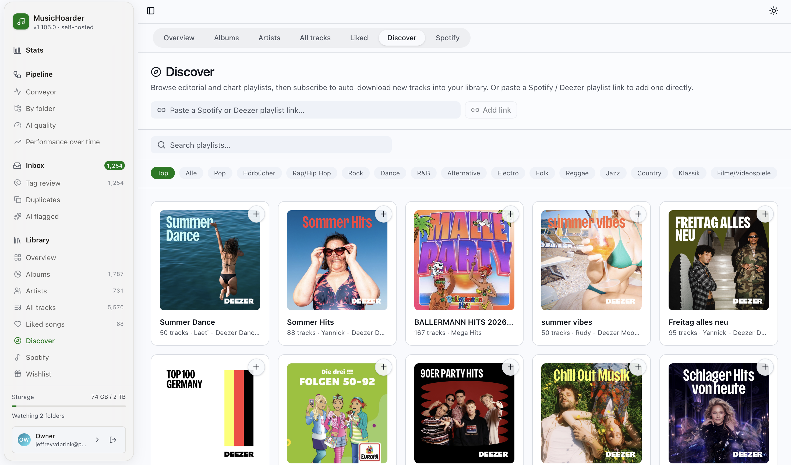
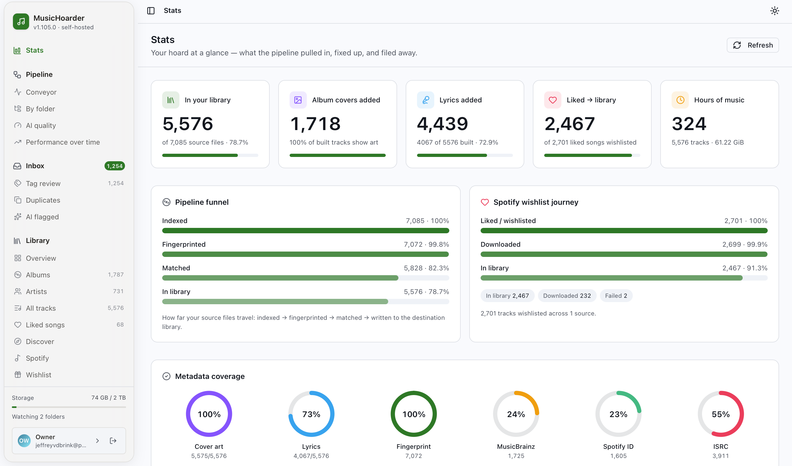

# MusicHoarder

**Fix your messy music library — automatically — then browse, play, like, and grow it.**

MusicHoarder is a self-hosted, open-source app that scans a large, disorganized music collection
(including NAS/SMB shares), identifies each track by its actual audio, enriches it with proper
metadata, and builds a clean, consistently-organized copy — without ever touching your originals.
Once it's clean, it's also a full music app: browse, play, like, get stats, discover new playlists,
and grow your library from Spotify or Soulseek.

[](https://github.com/Jeffreyyvdb/MusicHoarder/actions/workflows/ci.yml)
[](LICENSE)

If you've ever ended up with thousands of files like `track_047.mp3`, duplicate rips at different
bitrates, missing artwork, and inconsistent folder names, this is for you. Point it at your source
library, let it run, and review anything it isn't sure about.



## Features

### Identify, enrich & organize

- **Audio fingerprinting** — identifies each track by its actual sound (AcoustID/Chromaprint), not
  by unreliable filenames or existing tags, so `track_047.mp3` gets recognized for what it is.
- **Multi-provider enrichment with consensus** — every song is matched independently by up to six
  sources — **AcoustID**, **MusicBrainz**, **Spotify**, **Apple Music**, **Deezer**, and community
  trackers — and a consensus evaluator derives the verdict by agreement: when two or more providers
  land on the same recording it auto-matches, a lone fingerprint hit only becomes a candidate, and
  conflicting confident matches go to review. Every provider is individually toggleable, and the app
  degrades gracefully when a credential is missing.
- **Non-destructive, quality-aware tagging** — source files are always read-only; clean copies are
  written to a separate destination library. Matching never blindly overwrites good tags — empty
  fields are filled, a curated value that disagrees is kept and logged as a *proposed* change unless
  a strong consensus justifies the upgrade, and every applied or proposed change is recorded.
- **Whole-album reconciliation & healing** — because tracks are enriched independently, one real
  album can split across release IDs, titles, years, or artist spellings. A build-time reconciler
  elects one canonical identity per folder and tags every track with it, keeping albums whole in
  players like Navidrome. It's build-time and reversible — your per-track enrichment is untouched.
- **Canonical album tracklists** — cross-checks each album against MusicBrainz, Spotify, Apple
  Music, and Deezer to build the *full* tracklist, so the album view shows every real track and
  greys out the ones you're missing.
- **Cover art** — resolves album artwork (folder image → embedded picture, then Cover Art Archive →
  Deezer → iTunes when a file has none), validates it, and writes a single cover into each
  destination folder so players show the real sleeve.
- **Duplicate detection** — groups songs by identical fingerprint and elects the best copy (codec
  tier and bitrate, then metadata trustworthiness, then file size) so only the best version is built.
- **Synced lyrics + AI transcription** — fetches time-synced (karaoke-style) or plain lyrics from
  LRCLIB, embeds them into the built file, and shows them in the app with a synced/plain toggle.
  *Optional, experimental:* when no lyrics exist anywhere, an OpenAI-compatible **Whisper** pass
  (default `whisper-1`; repoint it at Groq or a self-hosted model) transcribes the audio into a fresh
  synced `.lrc` from Whisper's word/segment timestamps — stored **separately** from any curated
  lyrics and clearly marked, so it never overwrites the real thing. No key → the feature is just off.
- **Community trackers** *(optional)* — artist-scoped catalogs cover leaks, alternate versions, and
  unreleased albums that mainstream services don't, gated to a per-artist allowlist.

### Review & quality

- **Manual review Inbox** — a three-tab review surface with live counts: **Tag review**
  (low-confidence matches to approve, correct, or bulk-approve above a confidence threshold),
  **Duplicates** (A/B compare of fingerprint twins), and **AI flagged** (matches the grader marked
  Wrong or Questionable). Nothing is a dead end — unmatched and leaked tracks stay visible.
- **Optional AI quality grading** — an LLM grades each match (and whole-album matches) with a 0–100
  score, verdict, summary, and issue codes, powering rollups and flagged/verified buckets so you can
  triage what actually needs attention. OpenAI-compatible; defaults to OpenRouter, works with a local
  Ollama. Re-gradeable when the prompt or model changes.



### Browse, play & grow your library

- **Web UI** — browse by album, artist, track, folder, or liked; play in a persistent
  Apple-Music-style bar that survives navigation; jump anywhere with a ⌘K palette; open any track's
  full-screen provenance panel (Metadata / Lyrics / Fingerprint / Enrichment) and pipeline timeline;
  and watch every stage stream live — all fully responsive on mobile.
- **Likes, play tracking & Liked Songs** — heart any track for a Spotify-style Liked Songs view;
  playback is tracked (play count + last-played) to power most-played, recently-added, and
  "never played" shelves.
- **Stats & overview dashboards** — a "hoard at a glance" insights page (hero counts, pipeline and
  wishlist funnels, metadata-coverage rings, top artists, format breakdowns) plus a personalized home
  built from your real play and like history.
- **Discover playlists** *(optional)* — browse Deezer-backed editorial and chart playlists by genre
  or search, or paste a Spotify/Deezer playlist link, then subscribe so new tracks are wishlisted
  and (with downloads enabled) fetched automatically.
- **Spotify sync** *(optional)* — connect a Spotify account (read-only) and browse your Liked Songs
  and playlists with every track's local-library match shown inline. Add any playlist (or your Liked
  Songs) as an **auto-syncing wishlist source** so new additions flow in on their own, see a
  track-by-track *in-library vs missing* comparison, and a fast poll picks up songs you just liked
  within seconds.
- **Wishlist with auto-download** *(optional)* — everything wishlisted (from Spotify sync or
  Discover) is turned into an actual file by an ordered fetch chain: a self-run
  [slskd](https://github.com/slskd/slskd) (Soulseek) first, then a yt-dlp fallback that keeps native
  Opus and stamps the authoritative identity so the download enriches correctly and lands in the
  right album. Already-owned tracks are skipped; failures retry individually or in bulk. The whole
  *liked → wishlisted → downloaded → in library* journey is charted on the Stats page. Off by default.
- **Playlist export** *(optional)* — mirror your Spotify Liked Songs or any playlist as a static
  `.m3u8` file in the destination library, in order, so Navidrome/Plex/Jellyfin auto-import it.
- **Public share links & share view** — mint a revocable, no-account link scoped to a single track
  or a whole album. The public page is a chrome-free player with ambient artwork pulled from the
  cover, an album queue that plays straight through, and a **full-screen synced-lyrics theater** that
  scrolls line-by-line with the song and follows the queue as it advances. Nothing else in your
  library is exposed, and the link is revocable anytime.
- **Library history** — an audit log of every change written to the destination (album
  consolidations, artist renames, year corrections, cover art, per-field tag diffs), so you can see
  exactly "what Navidrome sees differently."



### Optional integrations

- **Navidrome two-way like sync** — keeps song likes in sync in both directions with a Navidrome
  server via its Subsonic *starred* API (immediate push on toggle + periodic reconcile).
- **Soulseek quality upgrades** — manually queue a search for a strictly-better copy of a track or
  album on Soulseek (via slskd); the better file is swapped **in place**, keeping the track's id,
  enrichment, and lyrics.
- **Instance sync (NAS → VPS)** — push finished tracks from a private instance to a public one over
  plain HTTPS. A portable fingerprint-based existence check means only missing or better-quality
  files transfer, in-place replacement keeps the remote's track ids stable, and an at-least-once
  outbox with retries survives crashes.

### Platform

- **Passwordless auth + read-only demo** — sign in by emailed magic link or WebAuthn passkey
  (Touch ID / Windows Hello / security key), with Owner (full control) and Demo (read-only) roles. A
  one-click **[Try the demo](https://musichoarder.app/login)** account browses and plays a seeded
  library while every mutating action is denied.
- **Self-hosted** — runs on your own hardware via .NET Aspire (dev) or Docker Compose (prod),
  pulling prebuilt GHCR images. Your music never leaves your machine.



## How it works

The pipeline is a state machine over each song, run by background workers that each sweep for work
in the status they handle:

```
Source library
   → Scan          index files (incl. SMB/NAS) and read embedded tags
   → Fingerprint   compute an audio fingerprint (fpcalc/Chromaprint)
   → Match         identify via AcoustID, then match against MusicBrainz,
                   Spotify, Apple Music, Deezer + community trackers
   → Decide        a consensus evaluator derives the verdict from all providers
   → AI grade      (optional) an LLM scores the match/metadata quality
   → Dedupe        detect duplicate recordings, keep the best copy
   → Build         copy + tag + organize into the destination library
```

Confident matches flow straight through to a clean destination library; uncertain ones — and
anything the AI grader flags — surface in the **Inbox** for a human decision. The source is never
modified, and removed/missing files are soft-deleted rather than purged. The whole flow is visible
live on the **Pipeline → Conveyor** dashboard.

## Tech stack

| Project | Description |
|---------|-------------|
| `MusicHoarder.Api` | ASP.NET Core minimal API — endpoints, EF Core/PostgreSQL persistence, and the background services that run the pipeline, enrichment providers, sync, and downloads |
| `MusicHoarder.AppHost` | .NET Aspire AppHost — composes the API, frontend, and PostgreSQL for local dev |
| `MusicHoarder.ServiceDefaults` | Shared cross-cutting defaults (health checks, OpenTelemetry, resilient HTTP) |
| `frontend` | SvelteKit 2 + Svelte 5 + Bun — the full web app: library browser, built-in player, live pipeline/conveyor, review Inbox, Discover, Stats, and share pages |

---

## Quickstart (local development)

### Prerequisites

- .NET 10 SDK
- Docker (for PostgreSQL via Aspire)
- Bun (frontend toolchain); Node.js 22 only for the semantic-release step
- `fpcalc` (`libchromaprint-tools`) for fingerprinting
- [Aspire CLI](https://aspire.dev) (optional — enables `aspire run`; otherwise use `dotnet run`)

### Run with Aspire (recommended)

```bash
aspire run
```

That's the whole thing. On first run the Aspire dashboard (at `https://localhost:17072`) prompts for
the two required values — your **source** and **destination** library paths — then provisions
PostgreSQL in Docker, launches the API, and starts the frontend. EF Core migrations are applied
automatically.

> No Aspire CLI? `dotnet run --project MusicHoarder.AppHost` does exactly the same thing. Install
> the CLI with `curl -sSL https://aspire.dev/install.sh | bash`.

**Optional — skip the prompts.** Pre-seed the paths (and any provider keys) as AppHost user-secrets
so boots are unattended and repeatable:

```bash
mkdir -p /tmp/musichoarder-source /tmp/musichoarder-dest
dotnet user-secrets set "Parameters:source-directory" "/tmp/musichoarder-source" --project MusicHoarder.AppHost
dotnet user-secrets set "Parameters:destination-directory" "/tmp/musichoarder-dest" --project MusicHoarder.AppHost
```

Drop a few audio files into your source directory, then trigger a scan from the UI (or let the
pipeline auto-run) to watch them flow through. Prefer to click around first? Open `/login` and hit
**Try the demo** for a read-only, seeded library.

### Frontend (standalone)

The AppHost runs the frontend via `.WithBun()`. To start it separately:

```bash
cd frontend && MUSICHOARDER_API_URL=http://localhost:<api-port> PORT=3000 bun run dev
```

Find the API port in the Aspire dashboard.

### Run tests

```bash
dotnet test MusicHoarder.Api.Tests/MusicHoarder.Api.Tests.csproj
```

The xUnit suite uses an in-memory EF Core provider — no PostgreSQL or Docker required.

---

## Configuration

All options live under the `MusicEnricher` section in `appsettings.json` or as environment variables
using the `MusicEnricher__` prefix.

| Key | Description | Required |
|-----|-------------|----------|
| `MusicEnricher__SourceDirectory` | Path to the source music library | Yes |
| `MusicEnricher__DestinationDirectory` | Path for the cleaned destination library | Yes |
| `MusicEnricher__AutoStartPipeline` | Auto-run the *processing* cascade (scan→fingerprint→enrich→build, enrichment backfill/retry sweep). Discovery (file indexing) always runs so the library still populates. Set `false` to require manual triggering of the heavy steps — useful in resource-constrained environments. | No (default: `true`) |
| `MusicEnricher__TempDirectory` | Scratch space for in-progress work | No (default: `/tmp/musicenricher`) |
| `MusicEnricher__AcoustIdApiKey` | AcoustID API key for fingerprint-to-MusicBrainz lookup | No (enrichment falls back to `NeedsReview` without it) |
| `MusicEnricher__AcoustIdScoreThreshold` | Minimum confidence score to accept a match (0–1) | No (default: `0.85`) |
| `MusicEnricher__SmbConcurrency` | Parallel file reads from SMB | No (default: `8`) |
| `MusicEnricher__EnrichmentWorkerConcurrency` | Parallel AcoustID lookups | No (default: `2`) |
| `ConnectionStrings__musichoarderdb` | PostgreSQL connection string | Yes (injected by Aspire in dev) |

Everything in the **Optional integrations** and several **Browse & grow** features above are off
until configured: Spotify (metadata + import) needs a registered Spotify app and the OAuth relay;
Discover/wishlist auto-download needs slskd and/or yt-dlp; Navidrome sync, instance sync, AI quality
grading, and the experimental AI lyrics transcription each have their own config sections
(`QualityGrading__`, `LyricsTranscription__`, sync/Navidrome/slskd settings). Lyrics transcription is
**hidden in the UI unless `LyricsTranscription__ApiKey` is set**. See the
[self-hosting guide](docs/SELF_HOSTING.md#optional-integrations) for the full reference.

---

## Self-host

Run MusicHoarder on your own box or NAS with Docker. The shipped `docker-compose.yml` **pulls
prebuilt images** from GHCR (`ghcr.io/jeffreyyvdb/musichoarder/{api,frontend}`) — no repo checkout
or build toolchain required. You only need two files: the compose file and an `.env`.

```bash
mkdir musichoarder && cd musichoarder
curl -fsSLO https://raw.githubusercontent.com/Jeffreyyvdb/MusicHoarder/main/docker-compose.yml
curl -fsSL  https://raw.githubusercontent.com/Jeffreyyvdb/MusicHoarder/main/.env.example -o .env
nano .env          # fill in the 5 required values
docker compose up -d
```

Required values in `.env`: `POSTGRES_PASSWORD`, `MUSIC_SOURCE_PATH`, `MUSIC_DESTINATION_PATH`,
`OWNER_EMAIL`, and `PUBLIC_BASE_URL`. The web UI is then at `http://<host-ip>:3000` (API at
`:5050`); migrations apply automatically.

The app serves plain HTTP — put it behind your own reverse proxy for TLS and point
`PUBLIC_BASE_URL` at the external URL.

**→ Full guide:** [docs/SELF_HOSTING.md](docs/SELF_HOSTING.md) — env reference, first login,
reverse proxy, Portainer/TrueNAS, optional integrations (AcoustID, Spotify, AI grading, AI lyrics
transcription, Navidrome sync, instance sync, Umami), updating, backups, build-from-source, and
troubleshooting.

---

## Deployment (CI/CD)

The whole repo (API **and** frontend together) is versioned as a single line by
[semantic-release](https://github.com/semantic-release/semantic-release). Deployment is
release-driven — only a semantic-release version publishes images and redeploys; routine
`chore`/`docs`/`refactor` pushes do not.

```
Push to main
     ↓
ci.yml          — dotnet build+test, frontend lint/check/test (also on PRs)
     ↓
release.yml     — semantic-release analyzes Conventional Commits; if warranted,
                  cuts a `vX.Y.Z` tag + GitHub Release, then dispatches ↓
     ↓
aspire-deploy.yml — builds the API + frontend images, pushes them to GHCR, semver-tags
                  them, then calls the Dokploy API to redeploy the Compose stack
```

The version bump follows the commit prefix — `fix:` → patch, `feat:` → minor,
`feat!:`/`BREAKING CHANGE:` → major; `chore`/`docs`/`refactor`/`test`/`style` cut no release. The
[Releases page](https://github.com/Jeffreyyvdb/MusicHoarder/releases) is the canonical changelog.

### Zero-downtime deploys

The prod compose (`MusicHoarder.AppHost/aspire-output/docker-compose.yaml`) declares a Swarm
`deploy.update_config` (`order: start-first`) plus Docker `healthcheck`s on the `api` and `frontend`
services. To get zero-downtime rollouts you must run the stack as a **Docker Stack (Swarm)** — in
Dokploy set the Compose service's **Compose Type to "Docker Stack"**. Swarm then starts the new task,
waits for its healthcheck to pass, and only then removes the old one, so there is no 502 window.
(Because Swarm ignores `pull_policy`, the stack deploy must run with `--resolve-image always` so the
unchanged `:latest` reference still re-pulls the newest digest.)

These keys are inert under plain `docker compose up` (Compose ignores `deploy.update_config`), so the
[Self-host](#self-host) path above is unaffected and keeps its current stop-then-start behavior —
self-hosters who want zero-downtime can likewise run their stack via `docker stack deploy`.

Operational detail — PR preview environments, the Spotify OAuth relay, and the Dokploy setup — lives
in the heavily-commented workflow files under [`.github/workflows/`](.github/workflows).

---

## Pipeline notes

### fpcalc + AcoustID

`fpcalc` (Chromaprint) is included in the Docker image via `libchromaprint-tools`. Without
`MusicEnricher__AcoustIdApiKey`, enrichment sets songs to `NeedsReview` rather than `Matched`, and
the Library Builder skips them.

### Library views

The Library **Overview / Albums / Artists / All tracks** views show what's in your destination
library; the **Pipeline → Conveyor** dashboard shows the full source-to-destination flow, and the
**Inbox** holds anything awaiting a human decision.

### EF Core migrations

Migrations are applied automatically on container startup in all environments. No manual migration
steps are required after a new image is deployed.

---

## Contributing & license

- **Contributing:** see [CONTRIBUTING.md](CONTRIBUTING.md). Commit messages follow
  [Conventional Commits](https://www.conventionalcommits.org/) — they drive the shared
  semantic-release version.
- **Security:** report vulnerabilities per [SECURITY.md](SECURITY.md).
- **License:** [MIT](LICENSE).
